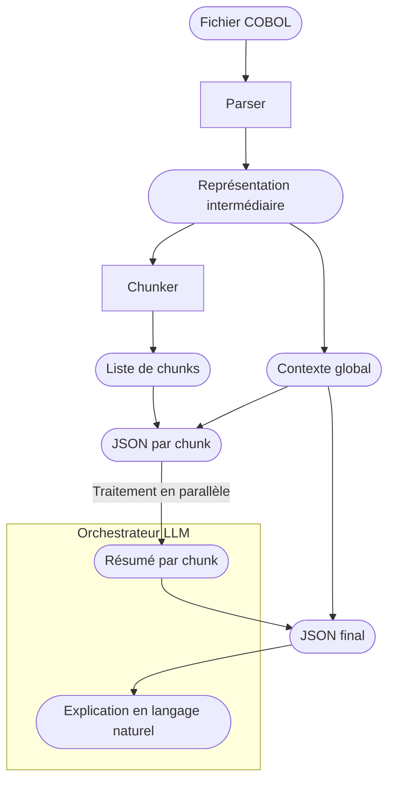

# Architecture fonctionnelle

## Schéma de l'architecture fonctionnelle

## Description de l'architecture fonctionnelle
L'architecture fonctionnelle de notre application se compose de plusieurs étapes clés pour transformer un fichier COBOL en une explication en langage naturel de son fonctionnement.

### Parser
Le parser est responsable de la lecture du fichier COBOL et de la création d'une représentation intermédiaire (RI) de son contenu.

### Chunker
Le chunker prend la représentation intermédiaire et la divise en morceaux plus petits, appelés "chunks". Chaque chunk représente une partie spécifique du code COBOL, ce qui permet de traiter le code de manière plus granulaire et de faciliter l'analyse par l'orchestrateur LLM.

### Orchestrateur LLM
L'orchestrateur LLM est responsable de la coordination du traitement parallèle des chunks par le LLM. Il reçoit les chunks et le contexte global, puis génère un résumé pour chaque chunk en faisant appel au LLM. Les résumés sont ensuite combinés pour créer une explication finale en langage naturel.

## Artefacts

### 1. Représentation intermédiaire (RI)
La représentation intermédiaire est une structure de données qui capture les éléments essentiels du code COBOL.
Elle peut être représentée sous forme de JSON ou d'une structure de données spécifique à l'application.

Elle contient les éléments suivants :

#### DataMap
C'est un dictionnaire à accès rapide `nom_variable → définition complète`.
Il permet de stocker la définition complète de chaque variable utilisée dans le code COBOL, ce qui facilite l'analyse et la compréhension du code même scindé.

#### ProcedureGraph
C'est un graphe orienté où chaque paragraphe pointe vers les paragraphes qu'il appelle via le mot clé COBOL PERFORM.
Il permet de visualiser les relations entre les différentes parties du code COBOL et de comprendre la structure du programme.

### 2. Contexte global
Produit à partir de la représentation intermédiaire, c'en est une version réduite injectée dans chaque appel LLM.
Il ne contient que ce qui est utile pour que le LLM comprenne le programme dans sa globalité.
C'est aussi ici que peut être injecté un prompt de contexte, pour guider le LLM dans la génération de l'explication.

### 3. JSON par chunk
Chaque chunk contient:
- **Le code COBOL brut** correspondant au chunk.
- **Le contexte global**
- **La liste des variables** utilisées dans le chunk, avec leurs définitions complètes extraites du **DataMap**.
- **La liste des procédures** appelées dans le chunk extraites du **ProcedureGraph**.
Chaque chunk est transformé en un format JSON qui peut être traité par le LLM.

### 4. JSON final
Le JSON final est une combinaison de tous les résumés générés pour chaque chunk, ainsi que le contexte global, qui est ensuite utilisé pour générer l'explication finale en langage naturel.
Ce JSON est structuré de manière à faciliter la génération de l'explication finale, en organisant les résumés par identifiant de chunk.

### 5. Explication en langage naturel
L'explication en langage naturel est le résultat final de l'ensemble du processus.
Elle est extraite du JSON final et fournit une explication claire et concise du code COBOL, en utilisant un langage naturel compréhensible pour les utilisateurs finaux.

Cette explication peut être utilisée pour aider les développeurs à comprendre le code COBOL, à identifier les parties critiques du code, et à faciliter la maintenance et l'évolution du code COBOL.