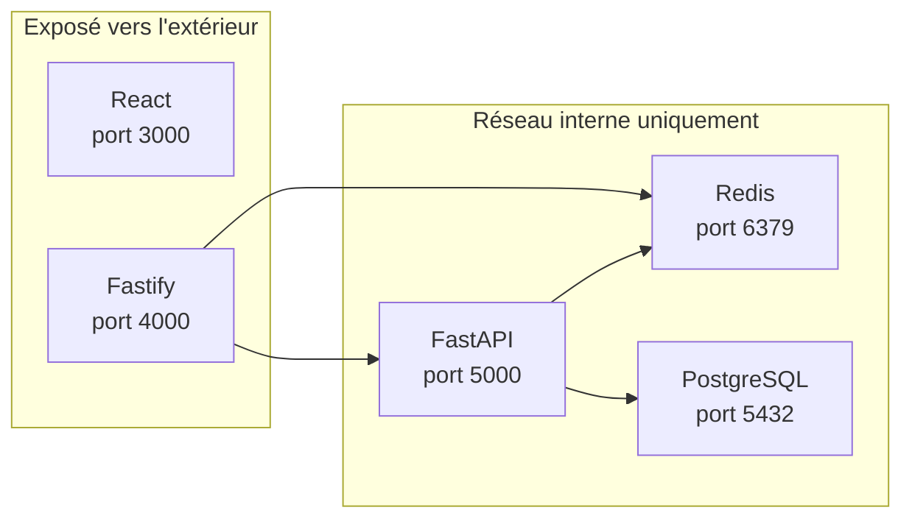

# Architecture micro-services

Pour mieux séparer les différentes couches de notre application,
nous allons adopter une architecture micro-services.
Chaque micro-service est responsable d'une fonctionnalité spécifique de l'application et communique avec les autres micro-services.

## Services

### Frontend (React)
Service de frontend, responsable de l'interface utilisateur et de l'expérience utilisateur. Il communique avec le service Fastify pour récupérer les données nécessaires à l'affichage.

### API Gateway (Fastify)
Service de passerelle API, responsable de la gestion des requêtes entrantes et de la communication avec les autres micro-services. Il reçoit les requêtes du frontend et les redirige vers les services appropriés.

### Backend IA (FastAPI)
Service IA responsable de la logique métier et de l'orchestration des requêtes liées à l'intelligence artificielle. Il communique avec le service Fastify pour recevoir les requêtes et avec Redis pour stocker les résultats intermédiaires du traitement parallèle des requêtes.

### Cache (Redis)
Service de cache, responsable du stockage temporaire des données pour améliorer les performances de l'application. Il est utilisé par le service FastAPI pour stocker les résultats intermédiaires et permettre le traitement en parallèle, et par le service Fastify pour récupérer le statut d'avancement du traitement parallèle des requêtes.

### Base de données (PostgreSQL)
Service de base de données, responsable du stockage permanent des données de l'application. Il est utilisé par le service FastAPI pour stocker les données nécessaires à l'intelligence artificielle et les réponses générées, et par le service Fastify pour récupérer les données nécessaires à l'affichage dans le frontend.

## Architecture proposée
L'architecture proposée est la suivante :

Cette architecture est basée sur l'utilisation de **conteneurs Docker** pour chaque micro-service, ce qui permet une isolation et une scalabilité faciles.
Chaque micro-service peut être développé, testé et déployé indépendamment des autres, ce qui facilite la maintenance et l'évolution de l'application.

## Sécurité
Pour sécuriser les communications entre les micro-services, nous allons utiliser des **tokens d'authentification** pour chaque service. Le service Fastify générera un token pour chaque requête entrante et le transmettra au service FastAPI, qui vérifiera le token avant de traiter la requête. De plus, nous allons configurer des **règles de pare-feu** pour limiter l'accès aux services internes uniquement aux services autorisés, et nous allons utiliser des **certificats SSL** pour chiffrer les communications entre les services.