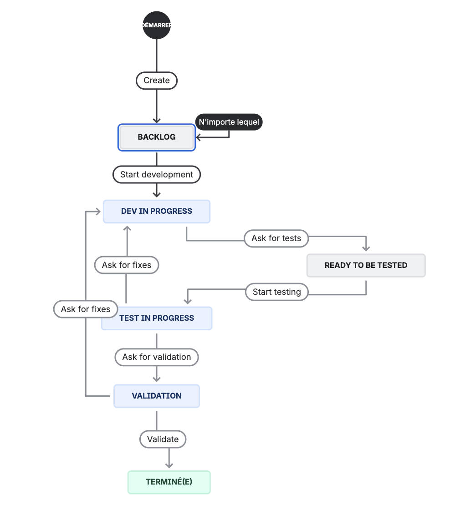

# Workflow d'utilisation de JIRA pour la gestion des tâches de développement

## 1. Backlog
Pendant le sprint planning, on s'attribue les tickets du backlog.

## 2. Dev in progress
Les développeurs assignés travaillent sur leur tâche
Lorsque toutes les sous-tâches de développement sont terminées, ils passent le ticket en "Test in progress" et ré-assignent le ticket au Rapporteur.
Si le Rapporteur est aussi le développeur, il peut assigner le ticket à un autre membre de l'équipe pour les tests en accord avec la matrice RACI.
La procédure de test doit être écrite dans la description du ticket JIRA.

## 3. Test in progress